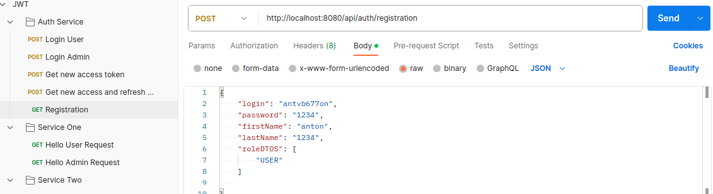
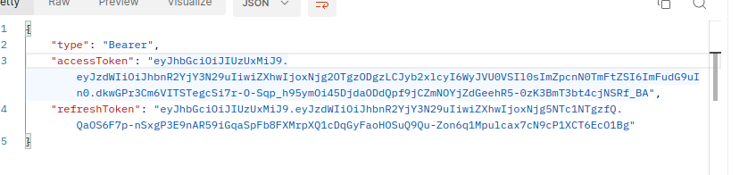
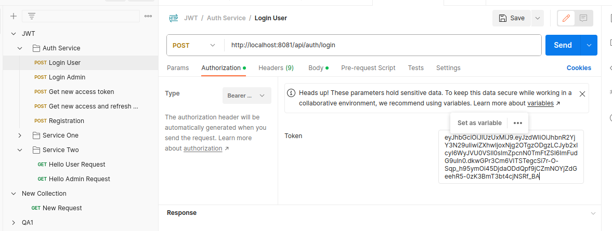
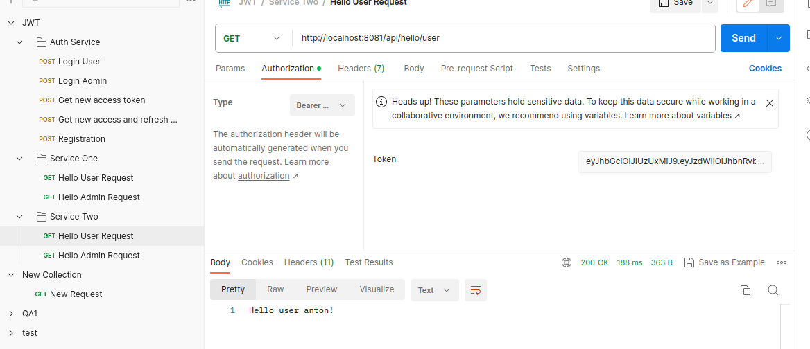

# Запуск приложения   
1. перейти в каталог .docker    
2. выполнить команду (должны быть свободны порты 8081, 5432,6379)
> docker compose up 
 

# Запросы 
 в папке проекта src/main/resources есть коллекция postman с готовыми запросами 
1. Создать пользователя

2. получаем токены и копируем access

3. Выбираем "логин" запрос и во вкладке authorization вставляем наш токен

4. тоже самое можно проделать с  endpoint ( api/hello/user)

